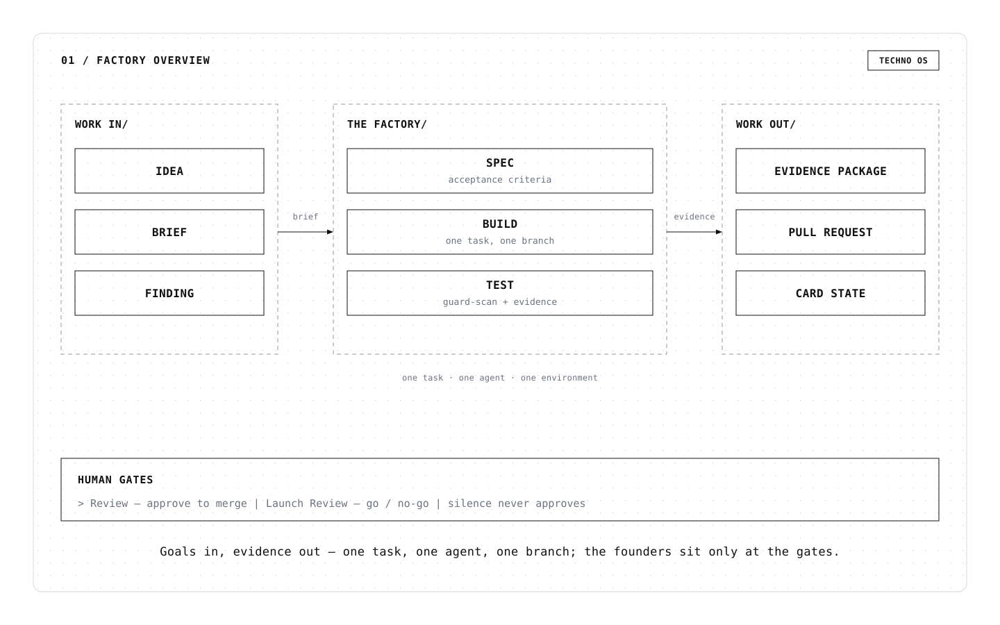

# Techno OS — Factory Module

This repository is the **factory module of Techno OS** — Techno Ventures' one system. Coffee is the collaborative surface, Smartware/Pod is the memory substrate, and this module is the founder-controlled execution engine: **idea → product, evidence-first, founders at the gates.**

**One system, not a separate deployable.** v1 = skill packs + guard scripts + Coffee configuration; the `src/`/`test/` TypeScript scaffold is the v0 tracer (reference only, not the v1 path).

## Docs (read order)

| File | What it is |
|---|---|
| `docs/techno-os.md` | **Canonical system doc** — what Techno OS is, principles, system map, how it runs on Coffee, guards, metrics, current state, decisions |
| `docs/pdlc.md` | The Product Development Lifecycle — every stage, what runs it, exit criteria, vocabulary |
| `docs/coffee-integration.md` | Coffee integration: verified surface (129 MCP tools), connection state, recipes, open gaps |
| `docs/portability.md` | Self-hosting + adapter contract — run the factory anywhere, fork it with your own tools |
| `docs/templates/` | Agent role prompts: `discovery-interviewer-agent.md`, `planner-agent.md` |
| `docs/visuals/` | Technical diagrams of the factory — Swiss-mono SVG + PNG set (5 boards) |

## Invariants (summary)

1. **Coffee-first** — anything expressible through Coffee's primitives is done in Coffee; new surface only where it genuinely cannot.
2. **Evidence, not claims** — the mission question is *did this actually happen?*
3. **Founders decide** — Review, Launch Review, production/credentials/money; silence never approves.
4. **Bounded** — WIP cap 3, spend ceiling with halt, no self-approval, mechanical diff scan at Review.
5. **Extend, don't multiply** — new capabilities on named triggers, not phases.

## Status

Sep 16 2026 — Coffee fully connected (148 MCP tools); factory runs 0–8 complete: first full cycle shipped (design-lint → CI → review → merge → evidence), the decisions rail verified end-to-end (notification → approve in Coffee → agent acts), CI self-heal live. Next: user-testing feedback intake; public launch. See `docs/techno-os.md` §7.

## License

Apache-2.0 — see `LICENSE`.
